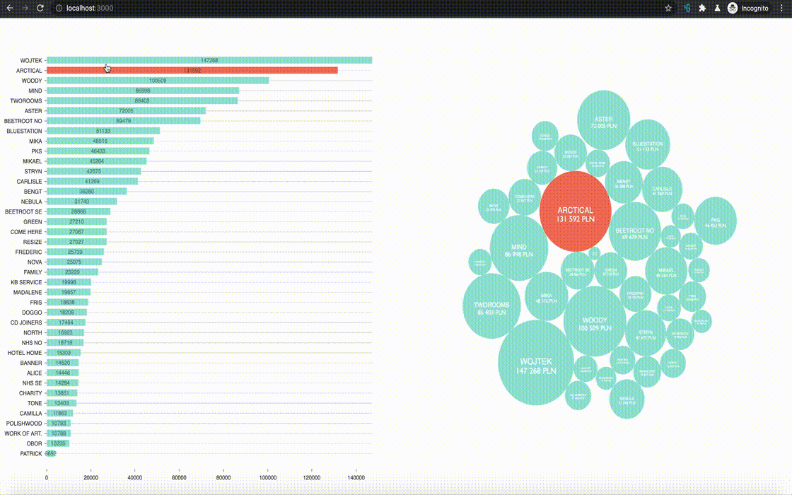

# Company Turnover Graph App



## Installation & Running

`docker-compose up --build`

## K8s deployment using local registry

```bash
docker build . -t frontend -f ./docker/frontend/Dockerfile
docker build . -t backend -f ./docker/backend/Dockerfile
docker build . -t csv-parser -f ./docker/csv-parser/Dockerfile

minikube start --insecure-registry="localhost:5000"
eval $(minikube docker-env)

docker run -d -p 5000:5000 --restart=always --name registry registry:2

docker tag frontend localhost:5000/frontend
docker tag backend localhost:5000/backend
docker tag csv-parser localhost:5000/csv-parser

docker push localhost:5000/frontend
docker push localhost:5000/backend
docker push localhost:5000/csv-parser

kubectl apply -f k8s/kompose/frontend.yaml,k8s/kompose/backend.yaml,k8s/kompose/csv-parser.yaml
```

to debug within cluster

```bash
kubectl describe pod <pod-id>
```

Useful links:
https://stackoverflow.com/questions/52698748/connection-refused-on-pushing-a-docker-image

cleanup

```bash
kubectl delete --all pods,services,deployments,replicasets
```

## Issues solved for future reference

- using d3 library
- data serving and consuming via graphql

## 2do

- own graphql- and python-based BE
- refactor `csv-parser` to OO-structure
- env file based docker-compose
- improve frontend UX: hints to user how to zoom, change cursor
- animate d3 graphs
- refactor frontend to achieve more modular structure
- update frontend unit and integration tests
